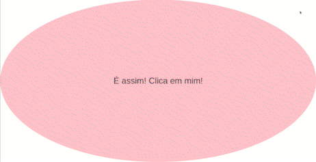

# kenzie-adding-box

Execercio de dom para kenzinhos

### Nesta entrega iremos treinar um pouco mais de DOM com events

Iremos criar todos so elementos dinamicamente pelo dom, serão 6 itens diferentes:

- tela de click inicial
- 4 caixas coloridas, com um breve conteúdo (cores a sua preferencia)
- e uma caixa maior para guardar todas as outras caixas coloridas

Com isso você precisará utilizar o "addEventListener" aprendido recentemente para fazer a movimentação por click
quando houver o click em uma caixa colorida ela deve ser transportada para dentro ou fora da caixa maior(caso ja esteja dentro).

## Segue o exemplo:

   <figure align="center">
      
   </figure>

## Rubrica

- Todos elementos gerados dinamicamente pelo DOM | 2pts
- Um botão de tela inicial que quando clicado gerará os proximos elementos | 2pts
- Quando clicadas as caixas coloridas vão para a caixa maior | 2pts
- Quando clicadas as caixas coloridas que estiverem dentro da caixa maior, são transportados para fora da mesma | 2pts

